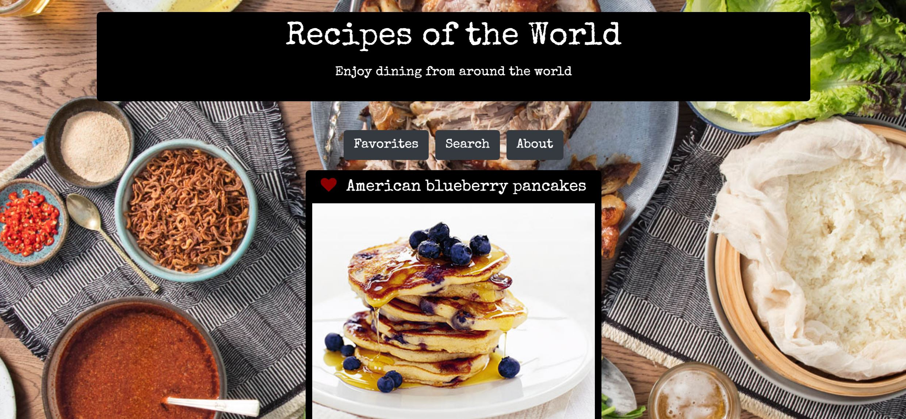

# SickGroup
This is a front end recipe application built with Bootstrap & jQuery for dynamic responsiveness utilizing both geo location and recipe APIs.

# How to use
Initial dishes will be offered based on your location in the world, and you may click on of these intial dishes to go to the recipe, favorite the recipe to be saved to your favorites list, or search for another type of recipe.  Once on the Ingredients page, there is a link to the recipe instructions. 

# Future enhancements
Storage of favorites in Firebase may be implemented in a future release

### [Try the App!](https://Edestiny7.github.io/SickGroup/)

Technology: HTML5 | CSS3 | JavaScript | jQuery Bootstrap | Google Fonts | API